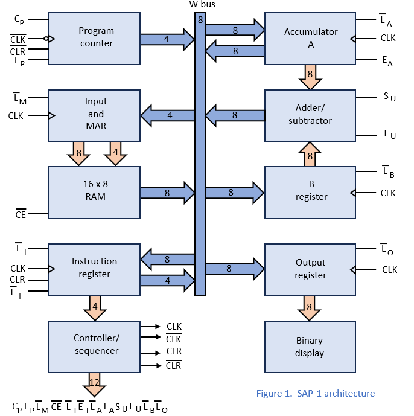
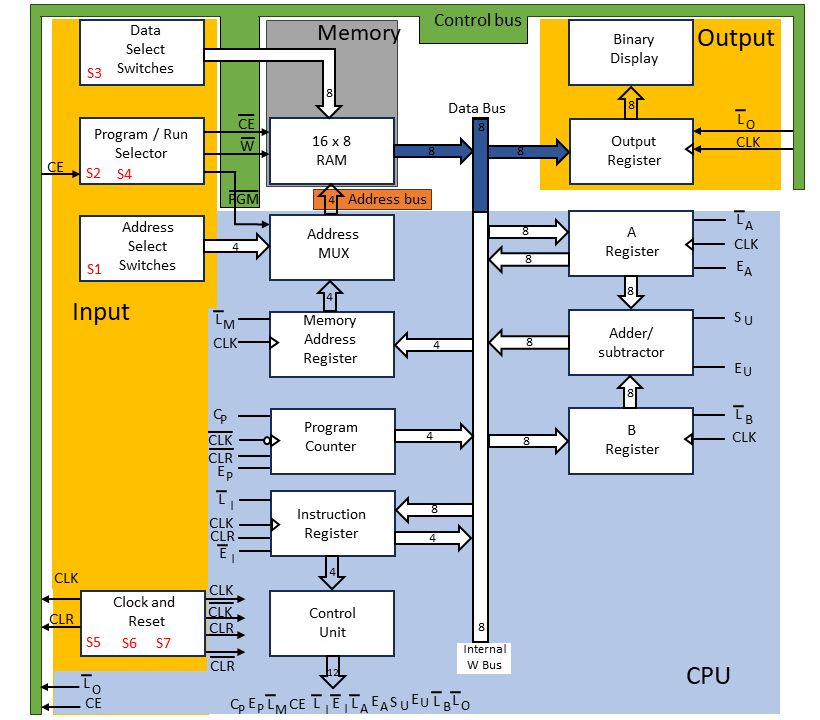

# Improved SAP Computer

The improved version of the SAP computer

By: Lincă Marius Gheorghe.

Pitești, Argeș, România, Europe.

https://github.com/LincaMarius/ISAP-Computer

## About the project, brief description

The goal of this project is to create a more efficient version of the SAP (Simple As Possible) Computer.
    
Credits are given to Albert Paul Malvino and Jerald A. Brown for introducing this architecture in their book "Digital Computer Electronics" and Ben Eater for implementing his own version of the SAP Computer using IC's and breadboards.

References: 
- Ben Eater's 8 Bit computer videos. Building an 8-bit breadboard computer! https://www.youtube.com/playlist?list=PLowKtXNTBypGqImE405J2565dvjafglHU
- Digital Computer Electronics - Albert Paul Malvino (Page 141).

An interesting fact is that I discovered a girl who made the SAP-1 calculator using breadboards in October 2011, and Ben Eater in February 2015, so 4 years earlier! This is that video: https://www.youtube.com/watch?v=KkTMICyp6xA. She built the SAP-1 computer using breadboards for a school project. It's a pity that the video presented is not of better quality.

## Stages of the project:
1 - Design requirements;
2 - Design improvement by analyzing and modifying the block diagram.
3 - Simulate functionality using one of the programs: Logisim, Logisim Evolution, LTspice, NI Multisim, Proteus, OrCAD, TINA, CircuitMaker, Simulink, etc. I will use Ligisim.
4 - Electrical diagram design using one of the programs: KiCAD, Altium Designer, Eagle, OrCAD, Fusion 360, Proteus, etc. - I will use KiCAD.
5 - Prototype creation and functionality testing.
6 - PCB design.
7 - Testing the new product.
8 - Final product assembly.
9 - Subsequent revisions of the product as often as necessary.

## Stage 1 - Design requirements:
- Technology used: TTL Logic or CMOS Logic
- Supply voltage: 5 Volts DC for TTL variant or 3 - 18 Volts DC for CMOS variant
- Power consumption: Maximum 10 Watts
- Power source: External
- Final product weight: As low as possible
- Final product dimensions: As small as possible
- Final product production cost: As low as possible
- Housing characteristics: Not applicable
- Product testing mode: Manual and/or automatic testing
- Target users: Didactic use, hobbyists
- Project completion deadline: as soon as possible.

## Stage 2 - Design improvement by analyzing and modifying the block diagram
The original Block Diagram of the SAP-1 computer can be found in the book "Digital Computer Electronics" by Albert Paul Malvino and Jerald A. Brown, on page 141 and is labeled Figure 10-1.

In the following figure, I present to you a reproduction of the block diagram of the SAP-1 computer.

I studied the original electronic schematic of the SAP-1 computer and recreated the block diagram to represent the actual functional blocks as closely as possible and I present it in the following figure.

As we learned at school, a computer can be represented by 3 distinct functional blocks: CPU, Memory and I/O. They are interconnected by 3 buses: the Data Bus, the Address Bus and the Control Bus.

This fact is also presented by the authors in the book in a simplified form on page 213 in figure 13-1.

A diagram representing a computing system consisting of functional blocks CPU, RAM, I/O and buses is presented in the following figure.

If we check the diagram of the SAP-1 computer we notice that these functional blocks are not grouped, we also cannot identify the three buses on the diagram. We are presented with only the data bus labeled "W bus".

So I propose to redraw the Block Diagram of the SAP-1 computer so that we can easily separate these elements: CPU, RAM and I/O, as well as we can easily identify the three buses. We get the following block diagram.

I presented a much more detailed version in the following figure.

### Problem 1 - The computer cannot write to the RAM memory.
From the analysis of the block diagram, I found the first problem that the computer cannot store data in the RAM memory
so the current configuration only allows reading the contents of the RAM memory ROM-specific behavior.

The computer stores the result of arithmetic operations only in register A.

