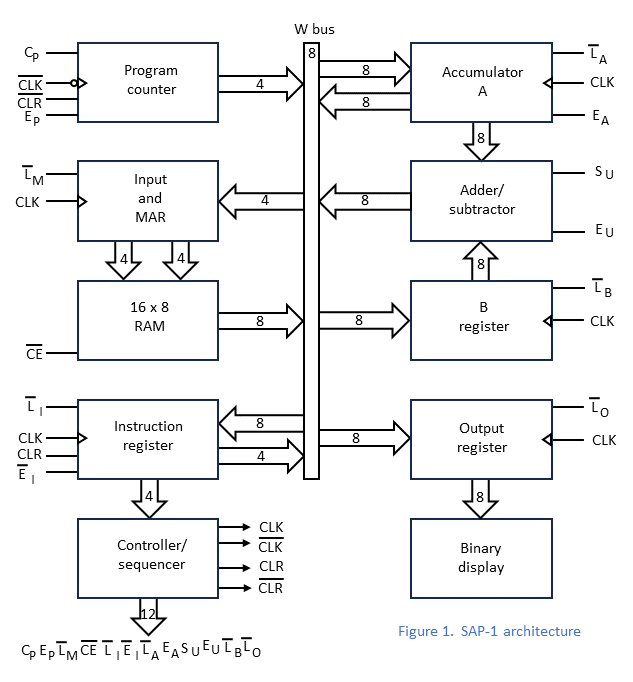
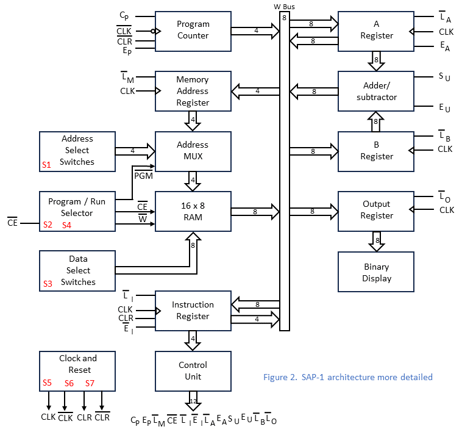
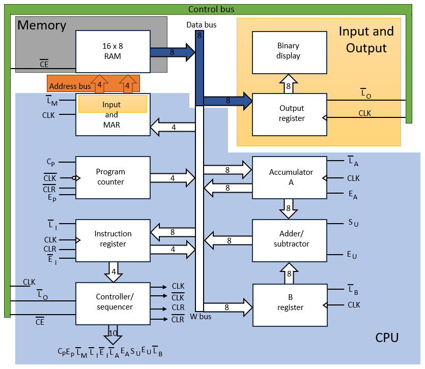
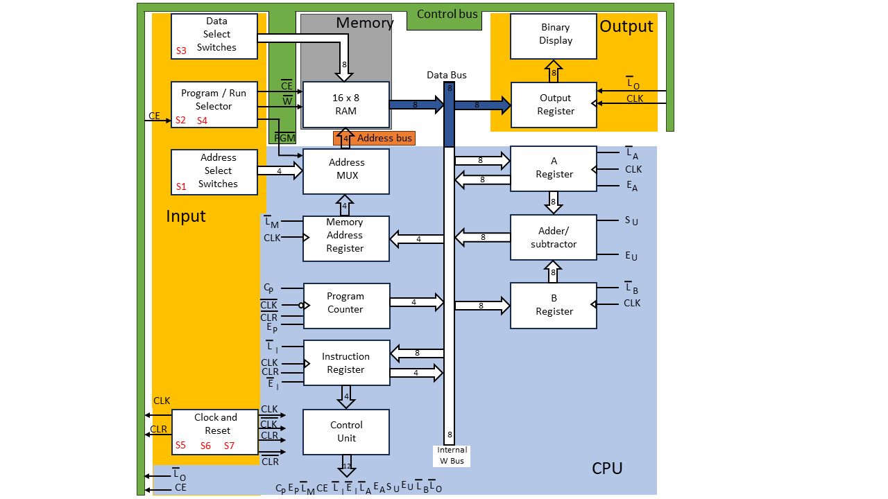

# Improved SAP Computer

The improved version of the SAP computer

By: Lincă Marius Gheorghe.

Pitești, Argeș, România, Europe.

https://github.com/LincaMarius/ISAP-Computer

## About the project, brief description

The goal of this project is to create a more efficient version of the SAP (Simple As Possible) Computer.
    
Credits are given to Albert Paul Malvino and Jerald A. Brown for introducing this architecture in their book Digital Computer Electronics and Ben Eater for implementing his own version of the SAP Computer using IC's and breadboards.

References: 
- Ben Eater's 8 Bit computer videos. Building an 8-bit breadboard computer! https://www.youtube.com/playlist?list=PLowKtXNTBypGqImE405J2565dvjafglHU
- Digital Computer Electronics - Albert Paul Malvino (Page 140)

An interesting fact is that I discovered a girl who made the SAP-1 calculator using breadboards in October 2011, and Ben Eater in February 2015, so 4 years earlier! This is that video: https://www.youtube.com/watch?v=KkTMICyp6xA

## Design requirements:
- Technology used: 5V TTL Logic
- Supply voltage: 5 Volts DC
- Power consumption: Maximum 10 Watts
- Power source: External
- Final product weight: As low as possible
- Final product dimensions: As small as possible
- Final product production cost: As low as possible
- Housing characteristics: Not applicable
- Product testing mode: Manual and/or automatic testing
- Target users: Didactic use, hobbyists
- Project completion deadline: as soon as possible.

## Stages of the project:
- Designing a block diagram for the computer
- Electrical diagram design using one of the programs: KiCAD, Altium Designer, Eagle, OrCAD, Fusion 360, Proteus, etc. - I will use KiCAD
- Simulate functionality using one of the programs: Logisim, Logisim Evolution, LTspice, NI Multisim, Proteus, OrCAD, TINA, CircuitMaker, Simulink, etc. I will use Ligisim
- Prototype creation and functionality testing
- PCB design
- Testing the new product
- Final product assembly/production
- Subsequent revisions of the product.

## The way the Versions will be defined:
The project starts from the implementation of a computer that has the same functionality as the SAP1 (Simple As Possible) computer.

Implementation will be done by adding one functional block from the block diagram, a change that will increase the computer version by 0.1.

The electrical diagram will be as similar as possible to the original diagram described in the book "Digital Computer Electronics - Albert Paul Malvino". I may use other ICs to implement the function blocks, but I want the functionality to be the same. At the end when all the functional blocks of the block diagram of the calculator will be implemented, this will represent version 1.0.

Any subsequent modification that will improve operation, add improved functionality to the computer, or introduce a new instruction. These changes will have a weight of 0.1 on the computer version.

Each version will be presented in its own directory and will have a video presentation on my YouTube channel: https://www.youtube.com/channel/UCDg7CNJKZFqwz0wlEnsU7Ng

## Versions will be as follows:
### Version 0.1
- "Control Panel" block implementation and "Input keyboard" implementation
### Version 0.2
- implementation of the "Output Register" block and the "Display" block
### Version 0.3
- "RAM" block implementation
### Version 0.4
- "MAR" block implementation
### Version 0.5
- "Program Counter" block implementation
### Version 0.6
- "Accumulator" block implementation
### Version 0.7
- "ALU" block implementation
### Version 0.8
- "Register B" block implementation
### Version 0.9
- "Instruction Register" block implementation
### Version 1.0
- "Control" block implementation and software testing

## Computer block diagram
The original Block Diagram of the SAP-1 computer can be found in the book "Digital Computer Electronics" by Albert Paul Malvino and Jerald A. Brown, on page 141 and is labeled Figure 10-1.

In the following figure, I present to you a reproduction of the block diagram of the SAP-1 computer.

I studied the original electronic schematic of the SAP-1 computer and recreated the block diagram to represent the actual functional blocks as closely as possible and I present it in the following figure.

As we learned at school, a computer can be represented by 3 distinct functional blocks: CPU, Memory and I/O. They are interconnected by 3 buses: the Data Bus, the Address Bus and the Control Bus.

This fact is also presented by the authors in the book in a simplified form on page 213 in figure 13-1.

A diagram representing a computing system consisting of functional blocks CPU, RAM, I/O and buses is presented in the following figure.

If we check the diagram of the SAP-1 computer we notice that these functional blocks are not grouped, we also cannot identify the three buses on the diagram. We are presented with only the data bus labeled "W bus".

So I propose to redraw the Block Diagram of the SAP-1 computer so that we can easily separate these elements: CPU, RAM and I/O, as well as we can easily identify the three buses. We get the following block diagram.

Now I will continue to carry out the following stages of this project: electrical scheme design in KiCAD, circuit simulation in Logisim Evolution, physical realization of the circuit using breadboards and functional testing.

